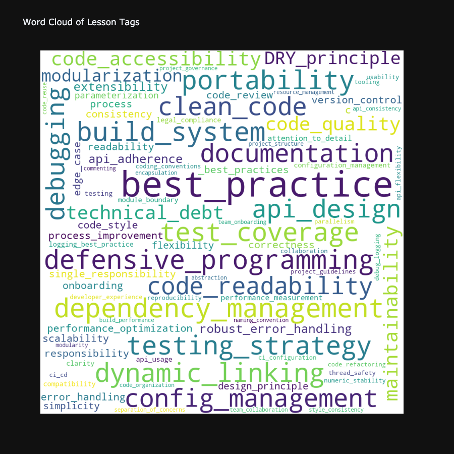

# PR Comment Analyzer

A data-driven tool that uses LLM to analyze pull request comments from popular open-source repositories, extract meaningful insights, and visualize patterns in code review feedback.

View the notebook here: [PR Comment Analysis Notebook](https://github.com/jimilp7/gitcomments/blob/main/pr_comment_section.ipynb)

## Features

- Fetches PR comments from GitHub repositories using GitHub API
- Uses LLM to extract structured insights from review comments. These insights can be used for Model Training, Fine-Tuning, and other purposes. Insights are structured in a CSV format with the following columns:
  - Issue
  - Code Before
  - Code After
  - Lesson
  - Source
  - Issue Tags
  - Lesson Tags
- Generates comprehensive visualizations:
  - Word clouds of common issues and lessons
  - Treemaps showing issue and lesson hierarchies
  - Bar charts of frequency distributions
  - Summary statistics dashboard

## Data Structure

The tool extracts structured insights from PR comments and stores them in CSV format. Here are example entries from the dataset:

| Issue | Code Before | Code After | Lesson | Source | Issue Tags | Lesson Tags |
|-------|-------------|------------|---------|---------|------------|-------------|
| Missing header include for std::iota | `// device_util_id.h`<br>`// Uses std::iota but missing <numeric>` | `#include <numeric>` | Always include necessary standard headers when using library functions to ensure portability across platforms. | issue_comment | `['missing_include', 'portability', 'build_error']` | `['defensive_programming', 'portability']` |
| Register method not publicly accessible | `class CopyTensor {`<br>` protected:`<br>`   static Status Register(...);`<br>` private:`<br>`   // ...`<br>`};` | `class CopyTensor {`<br>` public:`<br>`   // Dynamic registered devices use this function`<br>`   static void DynamicRegister(...);`<br>`   static Status Register(...);`<br>`};` | Ensure methods intended for external or dynamic use have appropriate visibility (public) to prevent access errors. | review_comment | `['access_modifier', 'api_design']` | `['api_design', 'code_accessibility']` |

Each row captures:
- **Issue**: The problem identified in the code review
- **Code Before/After**: The actual code changes made
- **Lesson**: The key learning extracted from the review
- **Source**: Whether it came from an issue or review comment
- **Tags**: Categorization of both the issue and the lesson learned

## Visualizations

### Summary Dashboard


### Issue Analysis


### Lessons Learned



### Performance Metrics


## Setup

1. Install dependencies:
```bash
pip install requests pandas plotly openai pydantic wordcloud
```

2. Set up GitHub authentication:
- Create a GitHub Personal Access Token
- Set it as an environment variable:
```bash
export GITHUB_TOKEN='your_token_here'
```

3. Run the notebook:
- Open `pr_comment_section.ipynb`
- Run cells sequentially to fetch data and generate visualizations